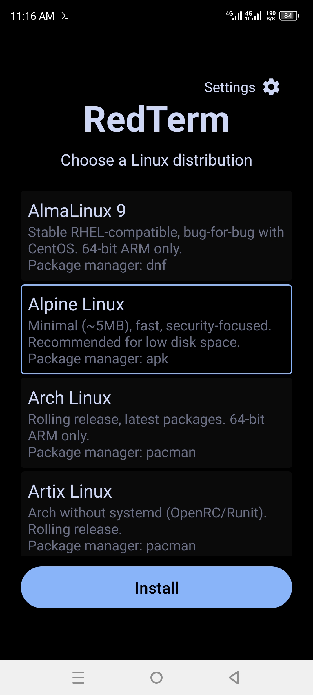
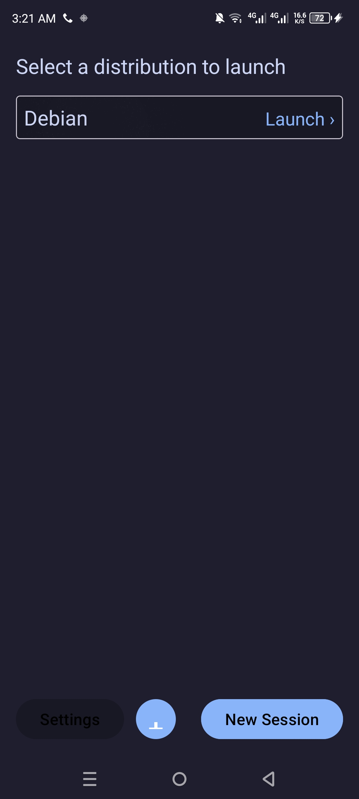
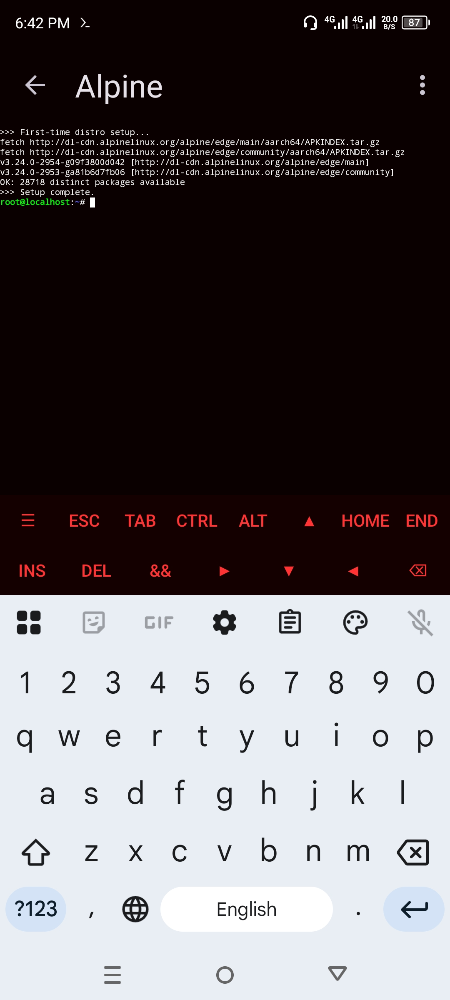

# RedTerm

A terminal emulator for Android that runs Linux distributions (Alpine, Debian, Ubuntu, Arch, Fedora) via proot — no root required.

## Features

- Multiple Linux distros installable from the app
- Proot-based execution (no root needed)
- Full terminal with extra keys row
- Multi-session support with drawer switcher
- Three color themes (Catppuccin Dark, Green Terminal, Light)
- Foreground service with notification controls
- Font size adjustment
- Haptic feedback on key press

## Screenshots

| Home | Installed | Terminal |
|:----:|:---------:|:--------:|
|  |  |  |

## Building

```bash
export ANDROID_HOME=/path/to/android-sdk
./gradlew assembleDebug
```

The debug APK will be at `app/build/outputs/apk/debug/app-debug.apk`.

## License

GPL-3.0
