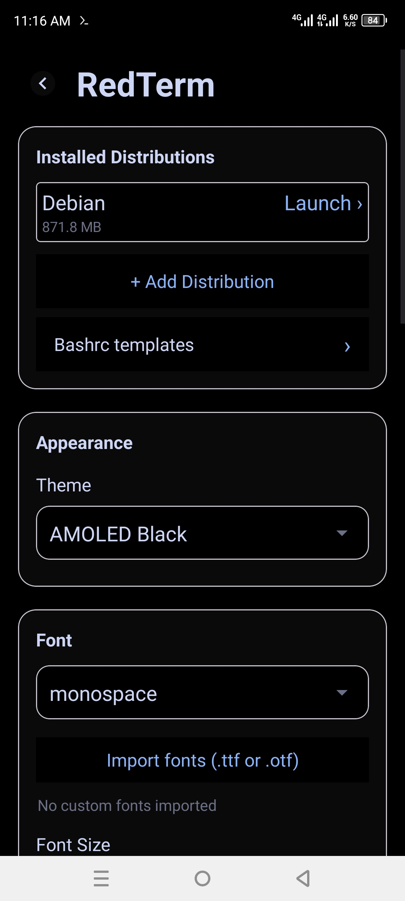

# RedTerm

[](https://github.com/GlobalTechInfo/RedTerm/releases/latest)
[](https://github.com/GlobalTechInfo/RedTerm/actions)
[](LICENSE)
[](https://developer.android.com/studio)

## Docs

- [Contributing](CONTRIBUTING.md)
- [Security](SECURITY.md)
- [Third-party notices](NOTICE.md)
- [Authors](AUTHORS.md)

A terminal emulator for Android that runs Linux distributions (Alpine, Debian, Ubuntu, Fedora, Void, Arch, Manjaro, Rocky, AlmaLinux, Artix, Kali) via **proot** — no root required.

## Features

- Multiple Linux distros installable from the app
- Proot-based execution — no root required, no system modification
- Full terminal with extra keys row
- Multi-session support with drawer switcher
- Eight color themes (Catppuccin Dark, AMOLED Black, Green Terminal, Light, Dracula, Nord, Tokyo Night, Gruvbox Dark)
- Foreground service with notification controls
- 8 monospace fonts (JetBrains Mono, Fira Code, Source Code Pro, Ubuntu Mono, monospace, Droid Sans Mono, Noto Sans Mono, Cascadia Code)
- Font size adjustment
- Haptic feedback on key press
- **Auto-init**: first-time distro setup installs packages (nano, wget, sudo, bash, openssl) and writes a full `.bashrc` with aliases, colored prompt, and completion

## Screenshots

| Home | Settings | Terminal |
|:----:|:---------:|:--------:|
|  |  |  |

## Building

Requirements:

- JDK 17
- Android SDK with `build-tools` and platform `android-36`
- Gradle 8.14.5 (via the included wrapper)
- Android Gradle Plugin 8.13.2, Kotlin 2.4.10 (managed by the project)

```bash
# Set ANDROID_HOME to your SDK location
export ANDROID_HOME=/path/to/android-sdk
./gradlew assembleDebug
```

The debug APK will be at `app/build/outputs/apk/debug/app-debug.apk`.

### Building proot from source

Proot is cross-compiled for Android using the NDK. See `native/build-proot.sh` for the build script. It:

1. Builds a static talloc library (from Samba)
2. Patches `loader/loader-fix.h` for PATH_MAX on newer NDKs
3. Compiles proot with `TALLOC`, `SECCOMP_FILTER`, `POKEDATA_WORKAROUND`, and `PROCESS_VM` support
4. Strips and installs to `app/src/main/jniLibs/<abi>/`

Pre-built binaries for `arm64-v8a` and `armeabi-v7a` are included in the repo.

## Distro support

| Distro | Status | Package manager | Init |
|--------|--------|-----------------|------|
| Alpine | Working | apk | `apk add nano wget sudo bash openssl` |
| Debian | Working | apt | `apt-get install nano wget sudo bash openssl` |
| Ubuntu | Working | apt | Same as Debian |
| Kali | Working | apt | Same as Debian |
| Fedora | Working | dnf | `dnf install nano wget sudo bash openssl` |
| Rocky | Working | dnf | Same as Fedora |
| AlmaLinux | Working | dnf | Same as Fedora |
| Void   | Working | xbps | `xbps-install -S nano wget sudo bash openssl` |
| Arch   | Working | pacman | `pacman -Syy` + `pacman -S --needed glibc gcc-libs nano wget sudo bash openssl` |
| Artix  | Working | pacman | Same as Arch |
| Manjaro | Working | pacman | `pacman -Syy` + `pacman -S nano wget sudo bash openssl` |

> **Arch note:** Arch's rootfs tarball ships with an older glibc than the current repositories. On first boot, RedTerm force-refreshes the package databases (`pacman -Syy`) and upgrades `glibc` + `gcc-libs` so current packages (npm, nodejs, etc.) can run — without downloading a full system upgrade.

## How it works

1. The app extracts a rootfs tarball to its private data directory
2. `launch.sh` sets up environment variables (`PROOT_LOADER`, `PROOT_TMP_DIR`, `ENV`, `PATH`)
3. proot starts with Android's `/system/bin/sh` in the chroot
4. The Android shell sources `/root/.startup` (via `ENV`) — runs first-time setup if needed
5. `.startup` drops the user into bash with the full `.bashrc`

## User Guide

### 1. Installation

1. Go to the [Releases page](https://github.com/GlobalTechInfo/RedTerm/releases/latest) and download the latest `app-debug.apk`
2. On your Android device, go to **Settings → Security → Install unknown apps** and allow installation from your file manager or browser
3. Open the downloaded APK file and tap **Install**
4. Once installed, open **RedTerm** from your app drawer

> **Requirements:** Android 8.0+ (API 26+), ARM64 device. No root access needed.

---

### 2. Home Screen

When you open RedTerm for the first time you will see:

- **"Select a distribution to launch" prompt** at the top — tap any distro card to open the terminal
- **Distro cards** — list of installed Linux distributions (empty on first launch)
- **+** button — tap to install a new distro
- **New Session** button — opens a new terminal session

---

### 3. Installing a Linux Distribution

1. On the home screen, tap **"+"** to open the distro selection screen
2. You will see the **Welcome/Distro selection screen** with available distributions:
   - Alpine Linux (small, fast)
   - Debian (stable, widely compatible)
   - Ubuntu (user-friendly)
   - Fedora (modern, latest packages)
   - Void Linux (minimal, runit init)
   - Arch Linux (rolling release, latest packages)
   - Manjaro (user-friendly Arch-based)
   - Rocky Linux (RHEL-compatible enterprise)
   - AlmaLinux (stable RHEL-compatible)
   - Artix Linux (Arch without systemd)
   - Kali Linux (penetration testing)
3. **Tap a distro** to select it
4. Tap **"Download & Install"**
5. The app will:
   - Download the rootfs tarball (~100–600 MB depending on distro)
   - Extract it to the app's private data directory
   - Verify the installation
6. Wait for the progress bar to complete (may take 1–5 minutes depending on your internet speed)
7. Once installed, you will return to the home screen and the distro will appear as a card with its name and disk size (e.g. `Alpine (85.2 MB)`)
8. **Tap the distro card** to launch the terminal

**First-time auto-setup:** When you launch a freshly installed distro for the first time, it automatically:
   - Updates the package manager cache (`apk update` / `apt-get update` / `pacman -Syy` / etc.)
   - Installs essential packages: `nano`, `wget`, `sudo`, `bash`, `openssl` (Arch also upgrades `glibc` and `gcc-libs` so current packages run on the older rootfs)
   - Writes a `.bashrc` with colored prompt, history settings, and useful aliases
   - Sets up `TERM=xterm-256color` and `stty erase ^?` for proper backspace behavior
   - This takes 1–3 minutes and only happens once

---

### 4. Terminal Screen

#### 4.1 Layout

The terminal screen has four main areas:

| Area | Description |
|------|-------------|
| **Toolbar** (top) | Shows distro name, back arrow (←), and three-dot menu (⋮) |
| **Terminal** (middle) | The actual terminal emulator — tap to type |
| **Extra Keys Row 1** | ☰ ESC TAB CTRL ALT ▲ HOME END |
| **Extra Keys Row 2** | INS DEL && ▶ ▼ ◀ ⌫ |

#### 4.2 Extra Keys

Two rows of shortcut buttons sit below the terminal. Each button fills the row equally.

**Row 1 (8 keys):**
| Key | Action |
|-----|--------|
| ☰ | Open the session drawer |
| ESC | Send Escape key (ASCII 27) |
| TAB | Send Tab key (ASCII 9) |
| CTRL | **Toggle** — tap once to activate (button turns blue); subsequent taps on the terminal are interpreted as Ctrl+key. Tap CTRL again to deactivate |
| ALT | **Toggle** — same as CTRL but for Alt combinations |
| ▲ | Arrow Up |
| HOME | Move cursor to start of line |
| END | Move cursor to end of line |

**Row 2 (7 keys):**
| Key | Action |
|-----|--------|
| INS | Insert toggle |
| DEL | Forward delete |
| && | Type "&&" (for chaining commands) |
| ▶ | Arrow Right |
| ▼ | Arrow Down |
| ◀ | Arrow Left |
| ⌫ | Backspace |

**CTRL & ALT toggles:** When active, the button background changes to a highlighted color so you can see they are on. Tap again to turn off.

#### 4.3 Three-Dot Menu (⋮)

Tap the three-dot menu in the top-right toolbar to access:

| Menu Item | What it does |
|-----------|-------------|
| **Sessions** | Opens the session drawer (same as tapping ☰) |
| **New Session** | Creates a new terminal session in the same distro |
| **Font +** | Increases terminal font size by 2 (max 36) |
| **Font −** | Decreases terminal font size by 2 (min 8) |
| **Reset** | Resets everything to defaults instantly: font → monospace, size → 20, theme → Red Terminal, and resets the terminal session |
| **Fonts →** | Submenu with 8 fonts: JetBrains Mono, Fira Code, Source Code Pro, Ubuntu Mono, monospace, Droid Sans Mono, Noto Sans Mono, Cascadia Code |
| **Theme →** | Submenu with 9 themes: Catppuccin Dark, Green Terminal, Light, Red Terminal, AMOLED Black, Dracula, Nord, Tokyo Night, Gruvbox Dark, Custom |

Font and theme changes apply immediately — no need to close the terminal.

#### 4.4 Touch & Keyboard

- **Tap anywhere** on the terminal to focus it and open the soft keyboard
- **Hardware keyboards** work natively (Ctrl, Alt, arrows, Tab, Esc, etc.)
- **Backspace** is configured via `.bashrc` (`stty erase ^?`) so it works correctly in the shell
- **Swipe down from the very top** of the terminal screen to open the Quick Toggles panel (see section 6)

---

### 5. Sessions

#### 5.1 Session Drawer

Tap **☰** (in extra keys row) or select **Sessions** (from the three-dot menu) to open the session drawer from the left.

The drawer shows:
- **Header** — "☰ Sessions" with a count badge showing total sessions, plus the distro name and disk usage (e.g. `alpine (85.2 MB)`)
- **Session cards** — one per session, each showing:
  - **Session name** (default: "session 1", "session 2", etc.)
  - **Active indicator** — ● (filled circle) for the current session, ○ (empty circle) for others
  - **✕ (close button)** — tap to close that session
- **"+ New Session"** button at the bottom

#### 5.2 Switching Between Sessions

- **Tap a session card** in the drawer → the terminal switches to that session immediately
- The drawer closes automatically after switching

#### 5.3 Closing Sessions

Two ways to close a session:
1. **Tap the ✕ icon** on the right side of the session card in the drawer
2. If only one session remains, closing it will exit the terminal activity

#### 5.4 Renaming Sessions

- **Long-press the session name** (the text like "session 1") in the drawer
- A dialog appears with the current name pre-filled
- Type a new name and tap **Rename**
- The name updates immediately in the drawer

#### 5.5 Creating New Sessions

Three ways to create a new session:
1. Tap **"+ New Session"** at the bottom of the drawer
2. Select **New Session** from the three-dot menu
3. Each new session runs a fresh proot instance in the same distro

---

### 6. Quick Toggles Panel

From the terminal screen, **swipe down from the very top edge** (within the first ~100 pixels from the top) to open the Quick Toggles panel:

```
┌─────────────────────────────┐
│ Quick Settings           ✕  │
├─────────────────────────────┤
│ [Wake lock] [A+] [A−] [Reset] │
├─────────────────────────────┤
│     Swipe up to close       │
└─────────────────────────────┘
```

| Button | What it does |
|--------|-------------|
| **Wake lock** | Toggle — turns CPU wake lock on/off (highlighted blue when active) |
| **A+** | Increase font size by 2 points |
| **A−** | Decrease font size by 2 points |
| **Reset** | Reset font, size, and theme to defaults + reset terminal session |

The panel slides down as an overlay. **Swipe up** or tap **✕** to dismiss.

---

### 7. Settings

All settings are organized into Material Design cards.

#### 7.1 Installed Distributions Card

| Feature | How it works |
|---------|-------------|
| **Distro list** | Shows each installed distro with name and disk usage (e.g. `Alpine (85.2 MB)` below the name) |
| **Launch a distro** | Tap the distro card → opens the terminal for that distro |
| **Uninstall a distro** | **Long-press** the distro card → a confirmation dialog appears → tap **Delete** to remove the rootfs and all user data for that distro |
| **Add a distro** | Tap **"+ Add Distribution"** in Settings → goes to the distro selection screen |

#### 7.2 Appearance Card

| Setting | Options | Details |
|---------|---------|---------|
| **Theme** | Radio buttons | Catppuccin Dark, AMOLED Black, Green Terminal, Light, Dracula, Nord, Tokyo Night, Gruvbox Dark, Red Terminal, **Custom** |
| **Customize Colors** | Button (visible only when "Custom" theme is selected) | Opens the custom theme editor (see section 8) |

All themes apply immediately (the activity recreates).

#### 7.3 Font Card

| Setting | Details |
|---------|---------|
| **Font picker** | Dropdown spinner with 8 options: JetBrains Mono, Fira Code, Source Code Pro, Ubuntu Mono, monospace, Droid Sans Mono, Noto Sans Mono, Cascadia Code |
| **Font Size** | SeekBar from 8 to 40 — set the terminal text size |

Changes apply immediately.

#### 7.4 Terminal Card

| Setting | Details |
|---------|---------|
| **Scrollback lines** | SeekBar with 10 levels: 500, 1K, 2K, 3K, 5K, 7.5K, 10K, 15K, 20K, 30K lines. Applied to new sessions |
| **Auto-hide extra keys** | Switch — when ON, the extra key rows hide when the keyboard is closed and reappear automatically when the keyboard opens |
| **Background opacity** | SeekBar 0–10 (0 = fully transparent, 10 = fully opaque). Controls terminal background and extra keys background transparency |
| **Export Config** | Button — saves all settings to a JSON file (see section 11) |

#### 7.5 Power Card

| Setting | Details |
|---------|---------|
| **Wake lock** | Switch — when ON, keeps the CPU running when the screen is off (for downloads, compilations, server processes, etc.) |
| **Backup Distro** | Button — creates a compressed tar.gz archive of the first installed distro's rootfs |
| **Restore Distro** | Button — shows a list of available backup files; tap one to restore |

---

### 8. Custom Theme Creator

Want your own color scheme? Here's how:

1. Open **Settings → Appearance**
2. Under Theme, select **"Custom"** (the last radio button)
3. A **"Customize Colors"** button appears — tap it
4. The color picker dialog opens with **three sections**, each with RGB sliders (0–255):

| Section | What it affects |
|---------|----------------|
| **Background** | Terminal background, drawer background, status bar |
| **Text** | Terminal text color, extra keys labels, all text |
| **Primary** | Accent color — buttons, links, active indicators |

5. For each section, drag the **R**, **G**, and **B** sliders to mix your color
6. The **preview blocks** update in real-time so you can see the result
7. Tap **Apply** to save and reload all screens with your custom theme
8. The custom colors are stored in preferences and persist across app restarts

**Tips for picking colors:**
- For a dark theme, keep Background values low (R=10–40, G=10–40, B=10–40)
- For high contrast, make Text bright (200–255) and Background dark (0–50)
- For a retro terminal look, use green text (#00FF00) on black background

---

### 9. Backup & Restore

#### Backup

1. Go to **Settings → Power**
2. Tap **Backup Distro**
3. The app creates a compressed archive named `{distroname}_backup.tar.gz`
4. A toast shows the filename and file size
5. The file is saved to the app's external files directory (`Android/data/com.redtermapp/files/`)
6. You can copy this file off the device using a file manager or USB transfer

**⚠ Note:** Only the first installed distro (alphabetically) is backed up per tap. For multiple distros, run the backup after launching each distro.

#### Restore

1. Copy a backup `.tar.gz` file to `Android/data/com.redtermapp/files/`
2. Go to **Settings → Power**
3. Tap **Restore Distro**
4. A dialog lists all `.tar.gz` files found in the app's files directory
5. Tap the backup you want to restore
6. The rootfs is extracted and the distro appears in your installed list
7. Launch the distro to verify the restore

---

### 10. Config Export

1. Go to **Settings → Terminal**
2. Tap **Export Config**
3. A `RedTerm_config.json` file is saved to the app's external files directory
4. A toast confirms the export

**Exported settings:**
- `theme` — current theme name (e.g. "red", "custom", "dracula")
- `custom_bg`, `custom_text`, `custom_primary` — RGB integer values for custom theme
- `font` — font family name
- `font_size` — current font size (8–40)
- `scrollback` — scrollback level index (0–9)
- `terminal_opacity` — opacity level (0–10)
- `autohide_keys` — boolean
- `wakelock` — boolean

You can open the JSON file in any text editor, view or edit the values, and keep it as a backup of your setup.

---

### 11. Notification & Foreground Service

When the terminal is running, RedTerm shows a **persistent notification** in the status bar with:

- **Icon:** A terminal prompt symbol (❯_) matching the app launcher icon
- **Title:** "RedTerm"
- **Text:** "Running"

The notification ensures the app stays alive in the background. Swiping away the notification will **not** stop the terminal (the service continues).

The notification icon appears in the top status bar near the network and battery indicators.

---

### 12. Themes Reference

| Theme | Background | Text | Accent | Mood |
|-------|-----------|------|--------|------|
| Catppuccin Dark | #1E1E2E | #CDD6F4 | #89B4FA | Purple-blue dark |
| AMOLED Black | #000000 | #CDD6F4 | #89B4FA | Pure black, battery-friendly |
| Green Terminal | #000000 | #33FF33 | #33FF33 | Retro green-on-black |
| Light | #F5F5F5 | #1E1E2E | #4A90D9 | Light mode |
| Dracula | #282A36 | #F8F8F2 | #BD93F9 | Pink-purple dark |
| Nord | #2E3440 | #D8DEE9 | #88C0D0 | Arctic blue dark |
| Tokyo Night | #1A1B26 | #A9B1D6 | #7AA2F7 | Deep indigo dark |
| Gruvbox Dark | #282828 | #EBDBB2 | #83A598 | Warm retro amber |
| Red Terminal | #0A0000 | #FF3333 | #FF4444 | Classic red-on-black |

---

### 13. Tips & Tricks

- **Ctrl key combinations:** Activate the CTRL toggle button, then tap a letter key on the extra keys row or keyboard. For example: CTRL + C = interrupt, CTRL + D = EOF, CTRL + Z = suspend
- **Multiple sessions for multitasking:** Open one session for editing with nano, another for running compilations or servers, and switch between them instantly via the drawer
- **Save battery:** Use the AMOLED Black theme on OLED screens — pure black pixels are turned off
- **Auto-hide extra keys:** Enable in Settings → Terminal to reclaim screen space when the keyboard is closed
- **Reload .bashrc:** After editing `.bashrc`, run `source ~/.bashrc` or start a new session
- **Font availability:** "monospace" and "Droid Sans Mono" work on almost all devices. Custom fonts (Cascadia Code, JetBrains Mono, Fira Code) depend on the device's built-in fonts
- **Free up space:** Long-press a distro in Settings → Installed Distributions and confirm delete to remove its rootfs entirely
- **Backup before uninstall:** Use the Backup feature before deleting a distro so you can restore it later
- **Scrollback:** If you need to review a lot of output, increase the scrollback lines in Settings → Terminal before creating a new session
- **Faster Arch downloads:** Edit `/etc/pacman.d/mirrorlist` inside the distro and put a mirror close to your region at the top (list at archlinuxarm.org) — the default mirror can be slow or briefly out of sync
- **Quick reset:** Use the three-dot menu → Reset, or the Quick Toggles panel → Reset, to restore all defaults without leaving the terminal

## Known limitations

- The app's data directory is typically mounted `noexec` on Android 12+
- proot's `-L` (kompat) flag handles noexec by loading binaries through `libproot-loader.so`
- Linker warnings about `/linkerconfig/ld.config.txt` are cosmetic and suppressed by bind-mounting the file

## License

GPL-3.0
