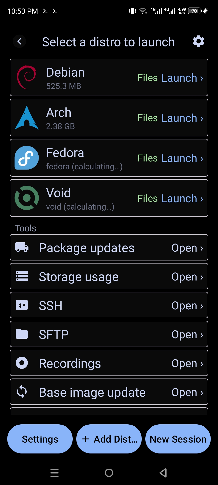
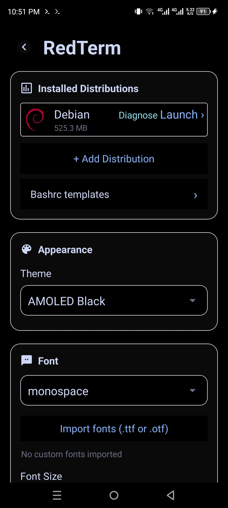
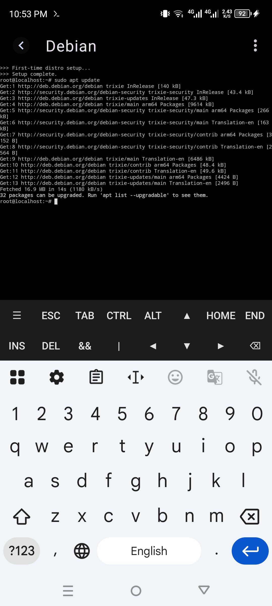
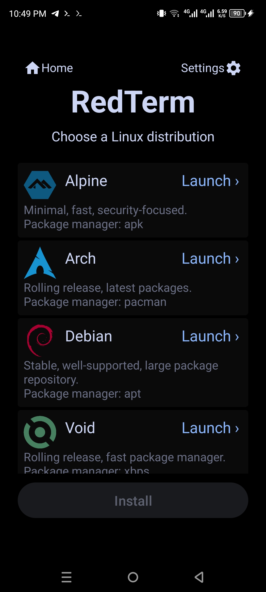
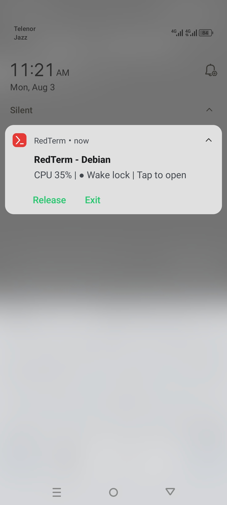
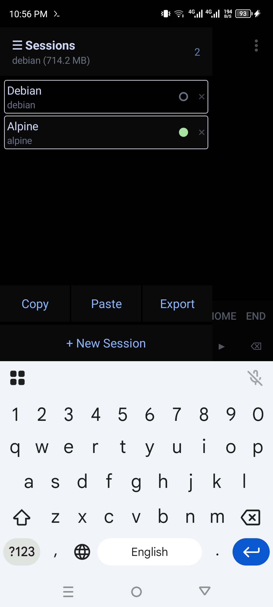

# RedTerm

[](https://github.com/GlobalTechInfo/RedTerm/releases/latest)
[](https://github.com/GlobalTechInfo/RedTerm/actions)
[](LICENSE)
[](https://developer.android.com/studio)

## Docs

- [Contributing](CONTRIBUTING.md)
- [Security](SECURITY.md)
- [Third-party notices](NOTICE.md)
- [Authors](AUTHORS.md)

A terminal emulator for Android that runs Linux distributions (Alpine, Debian, Ubuntu, Kali, Fedora, Void, Arch, Manjaro, Rocky, AlmaLinux, openSUSE) via **proot** — no root required.

## Download

<p>
  <a href="https://github.com/GlobalTechInfo/RedTerm/releases/latest">
    
  </a>
  <!-- PLACEHOLDER: replace with the published repo URL once GitHub Pages is live -->
  <a href="https://github.com/GlobalTechInfo/RedTerm#fdroid-repository">
    
  </a>
</p>

The GitHub build is the primary download. The F-Droid entry will point at this
project's own repository, which is built from the same signed release so you can
install from either and update in place.

## F-Droid Repository

RedTerm is built from source by the F-Droid client and is served from this
project's own repository. To install it:

1. Open F-Droid, or any client that supports custom repositories.
2. Go to **Settings → Repositories** and add:

   ```
   https://globaltechinfo.github.io/RedTerm/fdroid/repo
   ```

3. Refresh and install **RedTerm** from the added repository.

The repository carries the same signed APK as the GitHub release, so you can
install from either and update in place without reinstalling.

## Features

- Multiple Linux distros installable from the app
- Proot-based execution — no root required, no system modification
- Full terminal with extra keys row
- Multi-session support with drawer switcher
- Eight color themes (Catppuccin Dark, AMOLED Black, Green Terminal, Light, Dracula, Nord, Tokyo Night, Gruvbox Dark)
- Foreground service with notification controls
- 8 monospace fonts (JetBrains Mono, Fira Code, Source Code Pro, Ubuntu Mono, monospace, Droid Sans Mono, Noto Sans Mono, Cascadia Code)
- Font size adjustment
- Haptic feedback on key press
- **Auto-init**: first-time distro setup installs `bash` and `sudo` and writes a full `.bashrc` with aliases, colored prompt, and completion
- Built-in file manager with rename, copy, move, delete, recursive search, image/video preview and a text editor
- Multiple sessions per distro, and a separate session for every distro
- One-tap package updates, storage usage, SSH servers, ANSI recordings and base image updates from the home screen
- Bundled OpenSSH client: saved servers connect straight away, with no distro required
- Distro backup and restore that survives uninstalling the app

## Screenshots

| Home | Settings | Terminal |
|:----:|:---------:|:--------:|
|  |  |  |
|  |  |  |

## Building

Requirements:

- JDK 17
- Android SDK with `build-tools` and platform `android-37`
- Gradle 9.7.0 (via the included wrapper)
- Android Gradle Plugin 9.2.1, Kotlin 2.4.10 (managed by the project)

```bash
# Set ANDROID_HOME to your SDK location
export ANDROID_HOME=/path/to/android-sdk
./gradlew assembleDebug
```

The debug APK will be at `app/build/outputs/apk/debug/app-debug.apk`.

### Building proot from source

Proot is cross-compiled for Android using the NDK. See `native/build-proot.sh` for the build script. It:

1. Generates talloc's cross-compilation headers, then builds a static `libtalloc.a` (from Samba) **per ABI**
2. Checks out a pinned `termux/proot` commit and patches `loader/loader-fix.h` for `PATH_MAX` on newer NDKs
3. Compiles proot statically with 16 KB page alignment (`-z max-page-size=16384`)
4. Strips, verifies 16 KB alignment, and installs as `libproot.so` / `libproot-loader.so` / `libproot-loader32.so` into `app/src/main/jniLibs/<abi>/`

```bash
./native/build-proot.sh --all --ndk "$ANDROID_HOME/ndk/<version>"
# or a single ABI:
./native/build-proot.sh --arch aarch64 --ndk "$ANDROID_HOME/ndk/<version>"
```

Pre-built binaries for all four ABIs — `arm64-v8a`, `armeabi-v7a`, `x86_64` and `x86` — are included in the repo. The script needs `gawk` (proot's `loader-info.awk` uses `strtonum`).

### Building the OpenSSH client from source

The bundled `ssh` and `ssh-keygen` are cross-compiled for all four ABIs:

```bash
./native/build-openssh.sh --all --ndk "$ANDROID_HOME/ndk/<version>"
# one architecture at a time, and fewer parallel jobs on a phone:
./native/build-openssh.sh --arch aarch64 --jobs 2 --ndk "$ANDROID_HOME/ndk/<version>"
```

It builds OpenSSL 3.5.0 and OpenSSH 9.9p2 and installs the client into
`app/src/main/assets/ssh/<arch>/`. OpenSSL is built once per architecture and cached
(stamped with its version), so a relink reuses it; `--clean` discards the cache.

The client is a **dynamically** linked bionic PIE. This is not a preference. OpenSSH calls
`getpwuid()` unconditionally at the top of `main`, and bionic resolves that through NSS, which
reaches its service modules through the dynamic loader. A fully static client has no loader, so
NSS dereferenced a NULL function pointer and the client died with `SIGSEGV` at fault address
`0x0` before printing anything. Linking dynamically supplies `/system/bin/linker64` and fixes it.
`native/ssh_compat.c` also defines `getpwuid`/`getpwuid_r`/`getpwnam`/`getpwnam_r` so that *no*
passwd lookup in the process reaches bionic's NSS: the client is the executable, so its
definitions take precedence over the shared libc, and it only ever runs as the single root user
proot maps the session to.

Cross-compiling OpenSSH against bionic needs a handful of fixes, applied
automatically by `native/openssh-fixes.py` after `./configure`. The notable ones:
`autoconf`'s probes cannot detect attribute or libc support through a
cross-compiler, so `__sentinel__` and friends have to be declared by hand;
`reallocarray` and `nl_langinfo` are absent from bionic at RedTerm's minimum of
API 24 (not declared, let alone defined), so `HAVE_REALLOCARRAY`, `HAVE_NL_LANGINFO`
and `HAVE_LANGINFO_H` are forced **undefined** — claiming they exist is what broke
the dynamic link with undefined references. `reallocarray` then comes from OpenSSH's
own `openbsd-compat/reallocarray.c` and `dangerous_locale()` skips its codeset check; `getrrsetbyname`
depends on glibc's resolver internals that bionic does not have, so it is stubbed
to report a lookup failure; and `pick_salt()` is stubbed because bionic has no
`<shadow.h>`.

> `--jobs` defaults to 2. These builds run inside proot on a phone, where a
> `-j$(nproc)` OpenSSL build is enough to exhaust memory and kill the shell.

## Distro support

Rootfs images are the prebuilt releases published by
[termux/proot-distro](https://github.com/termux/proot-distro); each download is verified against a
per-architecture SHA-256 before extraction. Interrupted downloads resume automatically, and a failed
SHA-256 discards the partial file so the next attempt starts clean.

| Distro | Status | Package manager | First-time setup |
|--------|--------|-----------------|------------------|
| Alpine | Working | apk | `apk update && apk add bash sudo` |
| Debian | Working | apt | `apt-get update && apt-get install bash sudo` |
| Ubuntu | Working | apt | Same as Debian |
| Kali | Working | apt | Same as Debian (NetHunter rootfs) |
| Fedora | Working | dnf | `dnf makecache && dnf install bash sudo` |
| Rocky | Working | dnf | Same as Fedora |
| Alma | Working | dnf | Same as Fedora |
| openSUSE | Working | zypper | `zypper refresh && zypper install bash sudo` |
| Void   | Working | xbps | `xbps-install -Su && xbps-install -S bash sudo` |
| Arch   | Working | pacman | `pacman -Syyu --noconfirm && pacman -S --noconfirm --needed bash sudo` |
| Manjaro | Working | pacman | Same as Arch |

First-time setup installs `bash` and `sudo` on the first launch. If `bash` cannot be installed the
`.startup` script falls back to the distro's own `/bin/sh`, so the terminal is always usable. Distros
do **not** ship with extra packages preinstalled — everything else is installed on demand.

Kali Linux is the one exception to the image source: Kali is not published by Termux proot-distro, so
RedTerm installs NetHunter's own rootfs from `kali.download` instead. That path is a rolling release,
so its downloads are not checksum-verified the way the Termux images are; transport security is HTTPS
from the vendor.

If a package manager ever reports a name-resolution error (`temporary error` from apk, `Unable to
locate package` from apt), close and reopen the distro: RedTerm rewrites the distro's resolver
configuration from your device's current network on every launch. Android hands out DNS servers over
DHCP, so they change when you join a different network or switch between Wi-Fi and mobile data.

### Architecture support

Availability is limited by what the upstream project actually publishes for each distro — a ✗ means no
upstream image exists for that architecture, so the distro is hidden on a device using it. Rows other
than Kali Linux come from [termux/proot-distro](https://github.com/termux/proot-distro); Kali Linux
comes from NetHunter's rootfs on `kali.download`, which publishes arm64, armhf, amd64 and i386 images.

| Distro | aarch64 | x86_64 | arm | i686 |
|---|---|---|---|---|
| Alpine | ✓ | ✓ | ✓ | ✓ |
| Arch | ✓ | ✓ | ✓ | ✓ |
| Debian | ✓ | ✓ | ✓ | ✓ |
| Void | ✓ | ✓ | ✓ | ✓ |
| Ubuntu | ✓ | ✓ | ✓ | ✗ |
| Fedora | ✓ | ✓ | ✗ | ✗ |
| Alma | ✓ | ✓ | ✗ | ✗ |
| Rocky | ✓ | ✓ | ✗ | ✗ |
| openSUSE | ✓ | ✓ | ✗ | ✗ |
| Manjaro | ✓ | ✗ | ✗ | ✗ |
| Kali | ✓ | ✓ | ✓ | ✓ |

RedTerm's own proot binaries are shipped for all four ABIs (`arm64-v8a`, `armeabi-v7a`, `x86_64`, `x86`).

## How it works

1. The app extracts a rootfs tarball to its private data directory
2. `launch.sh` sets up environment variables (`PROOT_LOADER`, `PROOT_TMP_DIR`, `ENV`, `PATH`)
3. proot starts with Android's `/system/bin/sh` in the chroot
4. The Android shell sources `/root/.startup` (via `ENV`) — runs first-time setup if needed
5. `.startup` drops the user into bash with the full `.bashrc`

## User Guide

### 1. Installation

1. Go to the [Releases page](https://github.com/GlobalTechInfo/RedTerm/releases/latest) and download the latest `app-debug.apk`
2. On your Android device, go to **Settings → Security → Install unknown apps** and allow installation from your file manager or browser
3. Open the downloaded APK file and tap **Install**
4. Once installed, open **RedTerm** from your app drawer

> **Requirements:** Android 7.0+ (API 24+), ARM64, ARM, x86_64, or x86 device. No root access needed.

---

### 2. Home Screen

When you open RedTerm for the first time you will see:

- **"Select a distribution to launch" prompt** at the top — tap any distro card to open the terminal
- **Distro cards** — one per installed Linux distribution, showing its name and size on disk
- **Tools** section — utility cards below your distros (see the table below)
- **Bottom bar** — **Settings** on the left, **Add Distro** in the centre, **New Session** on the right

#### Tools

| Card | What it does |
|------|--------------|
| 📦 **Package Updates** | Pick a distro and run its own package manager update (`apt`, `dnf`, `pacman`, `zypper`, `apk` or `xbps`). The real output streams into the screen, and a notification tells you when it finishes — so you can leave the app and come back |
| 💾 **Storage Usage** | Free and total space on shared storage, plus, per distro, the largest directories with proportional bars |
| 🔑 **SSH** | Saved servers, SSH key generation, and one-tap connect (see section 10) |
| ⏺ **Recordings** | ANSI recordings — a command's output captured with colours and cursor control intact, replayable in the app (see section 10) |
| 🔄 **Base Image Update** | Check whether a newer proot-distro image exists for a distro and swap it in, keeping `/root` and `/home` (see section 12) |
| 🗄️ **Manage Backups** | List backup archives and restore, share or delete them (see section 9) |

Also in **Settings → App log**: a persistent log of the whole app, which can be copied to the
clipboard, shared, or downloaded to `Downloads/`. **Capture system log** pulls in everything the
process wrote to logcat — including the AndroidX and proot libraries — which is the quickest way to
diagnose something that fails and closes immediately.

Every one of these screens has the same back button in the top-left as the rest of the app.

#### Adding a distro

Tap **Add Distro** in the centre of the bottom bar to open the distro selection screen.

Before downloading, RedTerm checks that you actually have enough free space for the distro, and tells
you how much is needed if not — rather than failing part-way through extraction.

---

### 3. Installing a Linux Distribution

1. On the home screen, tap **"+"** to open the distro selection screen
2. You will see the **Welcome/Distro selection screen** with available distributions:
   - Alpine Linux (small, fast)
   - Debian (stable, widely compatible)
   - Ubuntu (user-friendly)
   - Kali Linux (penetration testing and security research)
   - Fedora (modern, latest packages)
   - Void Linux (minimal, runit init)
   - Arch Linux (rolling release, latest packages)
   - Manjaro (user-friendly Arch-based)
   - Rocky Linux (RHEL-compatible enterprise)
   - AlmaLinux (stable RHEL-compatible)
   - openSUSE Leap (zypper)
3. **Tap a distro** to select it
4. Tap **"Download & Install"**
5. The app will:
   - Download the rootfs tarball (~100–600 MB depending on distro)
   - Extract it to the app's private data directory
   - Verify the SHA-256 checksum, then extract
6. Wait for the progress bar to complete (may take 1–5 minutes depending on your internet speed)
7. Once installed, you will return to the home screen and the distro will appear as a card with its name and disk size (e.g. `Alpine (85.2 MB)`)
8. **Tap the distro card** to launch the terminal

**First-time auto-setup:** When you launch a freshly installed distro for the first time, it automatically:
   - Updates the package manager cache (`apk update` / `apt-get update` / etc.)
   - Installs `sudo`
   - Writes a `.bashrc` with colored prompt, history settings, and useful aliases
   - Sets up `TERM=xterm-256color` and `stty erase ^?` for proper backspace behavior
   - This takes 1–3 minutes and only happens once

---

### 4. Terminal Screen

#### 4.1 Layout

The terminal screen has four main areas:

| Area | Description |
|------|-------------|
| **Toolbar** (top) | Shows distro name, back arrow (←), and three-dot menu (⋮) |
| **Terminal** (middle) | The actual terminal emulator — tap to type |
| **Extra Keys Row 1** | ☰ ESC TAB CTRL ALT ▲ HOME END |
| **Extra Keys Row 2** | INS DEL && \| ◀ ▼ ▶ ⌫ |

#### 4.2 Extra Keys

Two rows of shortcut buttons sit below the terminal. Each button fills the row equally.

**Row 1 (8 keys):**
| Key | Action |
|-----|--------|
| ☰ | Open the session drawer |
| ESC | Send Escape key (ASCII 27) |
| TAB | Send Tab key (ASCII 9) |
| CTRL | **Toggle** — tap once to activate (button turns blue); subsequent taps on the terminal are interpreted as Ctrl+key. Tap CTRL again to deactivate |
| ALT | **Toggle** — same as CTRL but for Alt combinations |
| ▲ | Arrow Up |
| HOME | Move cursor to start of line |
| END | Move cursor to end of line |

**Row 2 (8 keys):**
| Key | Action |
|-----|--------|
| INS | Insert toggle |
| DEL | Forward delete |
| && | Type `&&` (for chaining commands) |
| \| | Type `\|` (for piping) |
| ◀ | Arrow Left |
| ▼ | Arrow Down |
| ▶ | Arrow Right |
| ⌫ | Backspace |

Both rows hold eight keys, so the buttons line up. If you customised the rows in Settings, the default
layout only applies after a reset — the app always shows whatever you saved.

**CTRL & ALT toggles:** When active, the button background changes to a highlighted color so you can see they are on. Tap again to turn off.

#### 4.3 Three-Dot Menu (⋮)

Tap the three-dot menu in the top-right toolbar to access:

| Menu Item | What it does |
|-----------|-------------|
| **Sessions** | Opens the session drawer (same as tapping ☰) |
| **New Session** | Creates a new terminal session in the same distro |
| **Font +** | Increases terminal font size by 2 (max 36) |
| **Font −** | Decreases terminal font size by 2 (min 8) |
| **Reset** | Resets everything to defaults instantly: font → monospace, size → 20, theme → Red Terminal, and resets the terminal session |
| **Fonts →** | Submenu with 8 fonts: JetBrains Mono, Fira Code, Source Code Pro, Ubuntu Mono, monospace, Droid Sans Mono, Noto Sans Mono, Cascadia Code |
| **Theme →** | Submenu with 9 themes: Catppuccin Dark, Green Terminal, Light, Red Terminal, AMOLED Black, Dracula, Nord, Tokyo Night, Gruvbox Dark, Custom |

Font and theme changes apply immediately — no need to close the terminal.

#### 4.4 Touch & Keyboard

- **Tap anywhere** on the terminal to focus it and open the soft keyboard
- **Hardware keyboards** work natively (Ctrl, Alt, arrows, Tab, Esc, etc.)
- **Backspace** is configured via `.bashrc` (`stty erase ^?`) so it works correctly in the shell
- **Swipe down from the very top** of the terminal screen to open the Quick Toggles panel (see section 6)

---

### 5. Sessions

#### 5.1 Session Drawer

Tap **☰** (in extra keys row) or select **Sessions** (from the three-dot menu) to open the session drawer from the left.

The drawer shows:
- **Header** — "☰ Sessions" with a count badge showing total sessions, plus the distro name and disk usage (e.g. `alpine (85.2 MB)`)
- **Session cards** — one per session, each showing:
  - **Session name** (default: "session 1", "session 2", etc.)
  - **Active indicator** — ● (filled circle) for the current session, ○ (empty circle) for others
  - **✕ (close button)** — tap to close that session
- **"+ New Session"** button at the bottom

#### 5.2 Switching Between Sessions

- **Tap a session card** in the drawer → the terminal switches to that session immediately
- The drawer closes automatically after switching

#### 5.3 Closing Sessions

Two ways to close a session:
1. **Tap the ✕ icon** on the right side of the session card in the drawer
2. If only one session remains, closing it will exit the terminal activity

#### 5.4 Renaming Sessions

- **Long-press the session name** (the text like "session 1") in the drawer
- A dialog appears with the current name pre-filled
- Type a new name and tap **Rename**
- The name updates immediately in the drawer

#### 5.5 Creating New Sessions

Three ways to create a new session:
1. Tap **"+ New Session"** at the bottom of the drawer
2. Select **New Session** from the three-dot menu, or **New Session** on the home screen
3. Each new session runs a fresh proot instance

A picker lists every installed distro, and shows how many sessions each already has open. Choosing the
distro you are already in starts a **second, independent session**, so you can run two shells in the
same distro side by side. Sessions opened from different distros stay separate — launching Debian never
switches you to an Alpine session, it opens a Debian one.

---

### 6. Quick Toggles Panel

From the terminal screen, **swipe down from the very top edge** (within the first ~100 pixels from the top) to open the Quick Toggles panel:

```
┌─────────────────────────────┐
│ Quick Settings           ✕  │
├─────────────────────────────┤
│ [Wake lock] [A+] [A−] [Reset] │
├─────────────────────────────┤
│     Swipe up to close       │
└─────────────────────────────┘
```

| Button | What it does |
|--------|-------------|
| **Wake lock** | Toggle — turns CPU wake lock on/off (highlighted blue when active) |
| **A+** | Increase font size by 2 points |
| **A−** | Decrease font size by 2 points |
| **Reset** | Reset font, size, and theme to defaults + reset terminal session |

The panel slides down as an overlay. **Swipe up** or tap **✕** to dismiss.

---

### 7. Settings

All settings are organized into Material Design cards.

#### 7.1 Installed Distributions Card

| Feature | How it works |
|---------|-------------|
| **Distro list** | Shows each installed distro with name and disk usage (e.g. `Alpine (85.2 MB)` below the name) |
| **Launch a distro** | Tap the distro card → opens the terminal for that distro |
| **Uninstall a distro** | **Long-press** the distro card → a confirmation dialog appears → tap **Delete** to remove the rootfs and all user data for that distro |
| **Add a distro** | Tap **Add Distro** in the centre of the home screen's bottom bar (section 2) |
| **Diagnose a distro** | Tap **Diagnose** on a distro card → reports on 12 health checks (rootfs layout, root uid, DNS, `bash`, `busybox`, `/bin/sh`, `/usr` permissions, `/tmp`, device nodes, `sudo`, `/root`, size) and can be copied to the clipboard |
| **Update the base image** | Tap **Base Image Update** on a distro card → checks for a newer published image (see section 11) |

#### 7.2 Appearance Card

| Setting | Options | Details |
|---------|---------|---------|
| **Theme** | Radio buttons | Catppuccin Dark, AMOLED Black, Green Terminal, Light, Dracula, Nord, Tokyo Night, Gruvbox Dark, Red Terminal, **Custom** |
| **Customize Colors** | Button (visible only when "Custom" theme is selected) | Opens the custom theme editor (see section 8) |

All themes apply immediately (the activity recreates).

#### 7.3 Font Card

| Setting | Details |
|---------|---------|
| **Font picker** | Dropdown spinner with 8 options: JetBrains Mono, Fira Code, Source Code Pro, Ubuntu Mono, monospace, Droid Sans Mono, Noto Sans Mono, Cascadia Code |
| **Font Size** | SeekBar from 8 to 40 — set the terminal text size |

Changes apply immediately.

#### 7.4 Terminal Card

| Setting | Details |
|---------|---------|
| **Scrollback lines** | SeekBar with 10 levels: 500, 1K, 2K, 3K, 5K, 7.5K, 10K, 15K, 20K, 30K lines. Applied to new sessions |
| **Auto-hide extra keys** | Switch — when ON, the extra key rows hide when the keyboard is closed and reappear automatically when the keyboard opens |
| **Background opacity** | SeekBar 0–10 (0 = fully transparent, 10 = fully opaque). Controls terminal background and extra keys background transparency |
| **Export Config** | Button — saves all settings to a JSON file (see section 12) |

#### 7.5 Power Card

| Setting | Details |
|---------|---------|
| **Wake lock** | Switch — when ON, keeps the CPU running when the screen is off (for downloads, compilations, server processes, etc.) |
| **Backup Distro** | Button — pick one or more installed distros and create compressed `.tar.gz` archives in `/sdcard/RedTerm` (see section 9) |
| **Restore Distro** | Button — opens the backup manager, where archives can be restored, shared or deleted (see section 9) |

---

### 8. Custom Theme Creator

Want your own color scheme? Here's how:

1. Open **Settings → Appearance**
2. Under Theme, select **"Custom"** (the last radio button)
3. A **"Customize Colors"** button appears — tap it
4. The color picker dialog opens with **three sections**, each with RGB sliders (0–255):

| Section | What it affects |
|---------|----------------|
| **Background** | Terminal background, drawer background, status bar |
| **Text** | Terminal text color, extra keys labels, all text |
| **Primary** | Accent color — buttons, links, active indicators |

5. For each section, drag the **R**, **G**, and **B** sliders to mix your color
6. The **preview blocks** update in real-time so you can see the result
7. Tap **Apply** to save and reload all screens with your custom theme
8. The custom colors are stored in preferences and persist across app restarts

**Tips for picking colors:**
- For a dark theme, keep Background values low (R=10–40, G=10–40, B=10–40)
- For high contrast, make Text bright (200–255) and Background dark (0–50)
- For a retro terminal look, use green text (#00FF00) on black background

---

### 9. Backup & Restore

#### Where backups live

Archives are written to **`/sdcard/RedTerm/`** as `{distroname}_backup.tar.gz`.

That location is deliberate: Android deletes an app's own storage when you uninstall it, so a backup
kept in app storage would be destroyed at exactly the moment you reinstall in order to restore it.
Backups in `/sdcard/RedTerm` survive uninstalling and reinstalling the app, and are only removed when
you delete them yourself.

> **All files access:** reading and writing that folder needs Android's "All files access" grant, and
> that grant is reset every time the app is installed. Without it your existing backups are still on
> the device but cannot be listed. RedTerm detects this and offers to grant it.

#### Creating a backup

1. Open **Settings → Power → Backup Distro**
2. Tick one or more distros and tap **Backup**
3. If any selected distro already has an archive you are asked what to do: **Overwrite** replaces it,
   **Keep old** leaves it untouched and skips that distro, **Cancel** backs up nothing
4. Progress is shown per distro, and a result dialog reports each one individually — for example
   `OK: debian — 412 MB` or `FAILED: kali — Ran out of storage space (94 MB left)`

An archive is written to a `.part` file first and only swapped into place once it is complete, so an
interrupted backup or a full disk can never destroy the archive you already had.

#### Restoring, sharing and deleting

Open **Manage Backups** on the home screen (or **Settings → Power → Restore Distro**). Each archive is
listed with its size and date; tap one to:

| Action | What it does |
|--------|--------------|
| **Restore Distro** | Replaces that distro's rootfs. If it is already installed you are asked to confirm, and the existing install is left untouched if the restore fails |
| **Share** | Sends the archive to another app |
| **Delete** | Removes the archive permanently |

If a backup was interrupted, the leftover `.part` file is listed as reclaimable space — it cannot be
restored, so you can safely delete it.

#### What is not backed up

Backups contain the distro's rootfs. Your app settings, custom fonts, bash templates and SSH server
list live in RedTerm's own storage and are not included; use **Export Config** (section 12) for those.

---

### 10. Package Updates, Storage, SSH & Recordings

These four tools are on the home screen under **Tools** (see section 2).

#### Package Updates

1. Tap **Package Updates** on the home screen
2. Choose a distro — the detected package manager is shown under the picker
3. Tap **Check and update**

The distro's own non-interactive update command runs (`apt-get update && apt-get upgrade -y`,
`dnf -y upgrade`, `pacman -Syu --noconfirm`, `zypper --non-interactive dup`, `apk update && apk upgrade`,
`xbps-install -Syu`). Output streams into the screen as it happens, and a notification is posted when it
finishes. Never prompts for input, so it cannot get stuck waiting for a keypress.

#### Storage Usage

Shows free and total space on shared storage, and — per distro — the largest directories inside the
rootfs with bars proportional to their size. Useful for finding what filled up a distro.

#### Arch and openSUSE take much longer to finish their first startup

The first time a terminal opens, RedTerm writes a startup script into the rootfs and
runs it. For most distributions that finishes in seconds. **Arch and openSUSE are the
exceptions and this is expected — let them run.**

- **Arch** runs a full `pacman -Syyu`, which downloads and upgrades the whole system:
  glibc, bash and several hundred packages. On a phone this takes minutes. The
  terminal is busy the entire time and must not be interrupted. Cancelling part-way
  leaves the database and the installed set out of step, and the next install will
  fail.
- **openSUSE** runs `zypper refresh`, which imports repository signing keys and
  downloads the metadata for each repository. The first run also shows a long list of
  "Received 1 new package signing key" messages per repository; that is key import
  happening once, not an error.

Progress is printed as it happens — package names, download sizes and transfer rates —
so a working startup is visibly busy rather than silent. If a line beginning
`>>> Warning:` or `>>> System update failed` appears, that is the only thing to pay
attention to; setup will not be marked complete and it retries on the next launch.

A first start that returns to a prompt in about a second means the startup script did
not run, which is a bug rather than a fast system.

#### Arch: sync the package databases once after a fresh install

**On a fresh Arch install, run `pacman -Syyu` once before installing anything.**

The Arch image ships a package database that is older than the mirror's. The versions
it names have since been superseded and removed from the mirror, so installing against
it fails with a genuine 404:

```
warning: curl-8.17.0-2 is up to date -- skipping
Packages (1) wget-1.25.0-3
 wget-1.25.0-3-aarch64.pkg.tar.xz failed to download
error: failed retrieving file 'wget-1.25.0-3-aarch64.pkg.tar.xz' from mirror.archlinuxarm.org : The requested URL returned error: 404
```

A partial upgrade is worse than none. Installing packages while glibc is still the
snapshot's older version can pull in a `libcurl` built against a newer glibc, and since
pacman is linked against libcurl, pacman itself then fails:

```
pacman: /usr/lib/libc.so.6: version `GLIBC_2.43' not found (required by /usr/lib/libcurl.so.4)
```

A full `pacman -Syyu` upgrades glibc in the same transaction and avoids this. A rootfs
that has already reached the state above has to be reinstalled from the welcome screen;
it cannot be repaired in place.

If the obsolete `gcc-libs` package is in the way, clear it with:

```bash
pacman -S --noconfirm --overwrite '/usr/lib/libgcc*' --overwrite '/usr/lib/libstdc++*' --overwrite '/usr/share/locale/*/LC_MESSAGES/libstdc++*' libgcc libstdc++
```

RedTerm does this for you, but only after the system update has run, so that the
package database it needs is already current.

#### SSH

Connections run a real **OpenSSH client bundled with the app** — the same terminal, driving the same
`ssh` binary, just without proot in between. Nothing needs to be installed first, and no distribution
is involved, so a saved server connects whether or not you have a distro installed.

1. Tap **SSH** on the home screen
2. **Add server** — give it a label, host, port (default 22) and user
3. **Connect** — opens a terminal session running `ssh` against that host
4. **Test** — runs one non-interactive probe (`BatchMode`, a 10 second connect timeout, remote
   command `true`) and shows the verbose trace. A session that dies silently is otherwise
   unactionable: by the time the error scrolls past, the terminal is gone. This names which side
   gave up — `Connection refused` (no sshd listening), `Permission denied (publickey)` (the key is
   not in the server's `authorized_keys`), an algorithm mismatch, or a timeout.

Host key checking stays on. The first connection to an unknown host asks you to confirm its
fingerprint, and it is remembered in the app's own `known_hosts` afterwards. If your key is the app's
default one it is passed with `-i`; otherwise `ssh` falls back to the usual agent and defaults.

**SSH keys** (same screen → **SSH keys**) lists the keys the app knows about and can generate a new
ed25519 pair. The public key is shown for copying — paste it into the server's `~/.ssh/authorized_keys`.

The client is a binary for your device's ABI, unpacked from the APK on first use into a small
rootfs of its own (`files/ssh-rootfs`). It runs through proot rather than being executed directly,
because Android 12+ mounts app storage `noexec` — the same reason distro binaries are launched the way
they are. Its home directory is `/root` inside that rootfs, so keys and `known_hosts` live at
`files/ssh-rootfs/root/.ssh` on the device.

Because they live in app storage, keys and `known_hosts` are removed when you uninstall RedTerm. Keep a
copy of anything you cannot regenerate. Host key checking stays on, and the first connection to an
unknown host asks you to confirm the fingerprint.

#### Recordings

1. Tap **Recordings** on the home screen, then **New recording**
2. Choose a distro and enter the command to record
3. When it finishes, the recording is listed with its size and date

Recordings capture the command's real output including colours and cursor control, by running it under
`script` so a pty is allocated. Tap a recording to **Play** it (replayed in a terminal view), **Share**
it, or **Delete** it. Requires the `script` utility (`util-linux`); RedTerm tells you if it is missing.

---

### 11. Base Image Update

The rootfs a distro starts from is a published image that keeps being updated upstream. **Base Image
Update** checks whether a newer image exists for a distro you have installed.

1. Tap **Base Image Update** on the home screen
2. Each installed distro shows the image it was built from
3. Tap **Check for update** on a distro
4. If a newer image exists you are shown what it is and asked to confirm

Applying the update replaces the distro's **system files** with the new image. Your **`/root` and
`/home` are kept**, including everything you have installed in them. Installed packages revert to
whatever the new image ships, because the package database is part of the system files.

The old rootfs is only discarded once the new files and your data are both in place; if any step fails,
the previous install is put back.

---

### 12. Config Export

1. Go to **Settings → Terminal**
2. Tap **Export Config**
3. A `RedTerm_config.json` file is saved to the app's external files directory
4. A toast confirms the export

**Exported settings:**
- `theme` — current theme name (e.g. "red", "custom", "dracula")
- `custom_bg`, `custom_text`, `custom_primary` — RGB integer values for custom theme
- `font` — font family name
- `font_size` — current font size (8–40)
- `scrollback` — scrollback level index (0–9)
- `terminal_opacity` — opacity level (0–10)
- `autohide_keys` — boolean
- `wakelock` — boolean

You can open the JSON file in any text editor, view or edit the values, and keep it as a backup of your setup.

---

### 13. Notification & Foreground Service

When the terminal is running, RedTerm shows a **persistent notification** in the status bar with:

- **Icon:** A terminal prompt symbol (❯_) matching the app launcher icon
- **Title:** "RedTerm"
- **Text:** "Running"

The notification ensures the app stays alive in the background. Swiping away the notification will **not** stop the terminal (the service continues).

The notification icon appears in the top status bar near the network and battery indicators.

---

### 14. Themes Reference

| Theme | Background | Text | Accent | Mood |
|-------|-----------|------|--------|------|
| Catppuccin Dark | #1E1E2E | #CDD6F4 | #89B4FA | Purple-blue dark |
| AMOLED Black | #000000 | #CDD6F4 | #89B4FA | Pure black, battery-friendly |
| Green Terminal | #000000 | #33FF33 | #33FF33 | Retro green-on-black |
| Light | #F5F5F5 | #1E1E2E | #4A90D9 | Light mode |
| Dracula | #282A36 | #F8F8F2 | #BD93F9 | Pink-purple dark |
| Nord | #2E3440 | #D8DEE9 | #88C0D0 | Arctic blue dark |
| Tokyo Night | #1A1B26 | #A9B1D6 | #7AA2F7 | Deep indigo dark |
| Gruvbox Dark | #282828 | #EBDBB2 | #83A598 | Warm retro amber |
| Red Terminal | #0A0000 | #FF3333 | #FF4444 | Classic red-on-black |

---

### 15. Tips & Tricks

- **Ctrl key combinations:** Activate the CTRL toggle button, then tap a letter key on the extra keys row or keyboard. For example: CTRL + C = interrupt, CTRL + D = EOF, CTRL + Z = suspend
- **Multiple sessions for multitasking:** Open one session for editing with nano, another for running compilations or servers, and switch between them instantly via the drawer
- **Save battery:** Use the AMOLED Black theme on OLED screens — pure black pixels are turned off
- **Auto-hide extra keys:** Enable in Settings → Terminal to reclaim screen space when the keyboard is closed
- **Reload .bashrc:** After editing `.bashrc`, run `source ~/.bashrc` or start a new session
- **Font availability:** "monospace" and "Droid Sans Mono" work on almost all devices. Custom fonts (Cascadia Code, JetBrains Mono, Fira Code) depend on the device's built-in fonts
- **Free up space:** Long-press a distro in Settings → Installed Distributions and confirm delete to remove its rootfs entirely
- **Backup before uninstall:** Use the Backup feature before deleting a distro so you can restore it later
- **Scrollback:** If you need to review a lot of output, increase the scrollback lines in Settings → Terminal before creating a new session
- **Faster Arch downloads:** Edit `/etc/pacman.d/mirrorlist` inside the distro and put a mirror close to your region at the top (list at archlinuxarm.org) — the default mirror can be slow or briefly out of sync
- **Quick reset:** Use the three-dot menu → Reset, or the Quick Toggles panel → Reset, to restore all defaults without leaving the terminal

## Known limitations

- The app's data directory is typically mounted `noexec` on Android 12+
- proot's `-L` (kompat) flag handles noexec by loading binaries through `libproot-loader.so`
- Linker warnings about `/linkerconfig/ld.config.txt` are cosmetic and suppressed by bind-mounting the file
- For the same reason the bundled `ssh` client is **not** executed directly: it is unpacked into a
  minimal rootfs and run through proot, so it works on exactly the same terms as the distro binaries.
  Only the client binary is needed there, because it is statically linked.

## License

GPL-3.0
